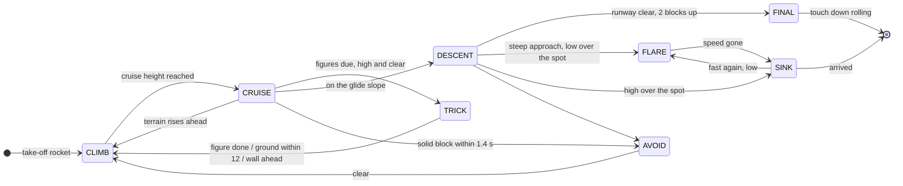
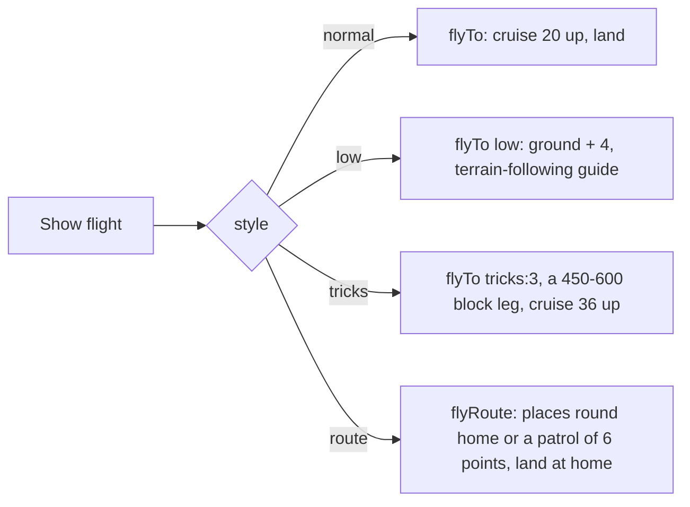
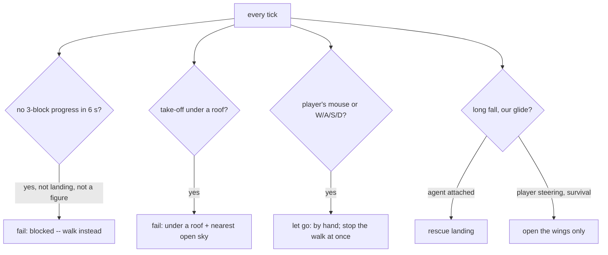

# Elytra pilot

How the bot flies: `ElytraFlight` (the controller in the game: kit, take-off, sensors, waypoints,
watchdogs) drives `ElytraPilot` (pure flight logic, no Minecraft classes, so the offline bench in
`tools/elytra` runs the very same code against a copy of vanilla glide physics).

The pilot flies like a plane rather than a rocket on a stick: it holds a flight-path angle (gamma)
with a P+I loop, moves the controls at a limited rate, and treats fireworks as a throttle.

## Flight modes



| Mode | What it does |
|---|---|
| CLIMB | Climbs at 8-30 degrees towards the cruise height; rockets while slow or early. Also taken over a ridge and when the ground comes within 6 blocks. |
| CRUISE | Soars through an 8-block band 20 blocks over the highest ground ahead, a rocket only at the bottom of the band. Low-level: follows the ground 4 blocks up. |
| DESCENT | Down the glide slope: 7 degrees over a clear runway, 14 when something stands near the spot. |
| FINAL | Plane landing: a round-out a few blocks up, touch down rolling. |
| FLARE | Braking turn over the spot: the look 80 degrees off the path takes 8-10 % of the speed a tick, without climbing. |
| SINK | Spiral down onto the spot at a set sink rate: 0.42 a tick high up, 0.25 over the last 10 blocks (a glide counts fall distance only past 0.5). |
| AVOID | A pull-up at 35 degrees with power: something solid along the flight path. |
| TRICK | An aerobatic figure (see below). |
| FOLLOW | Wingman: a slot 5 blocks right, 2 back, 1 up of a flying player. |

## Flight styles



- **Low-level (бреющий).** The guide is the steepest flight-path angle that passes 4 blocks over
  every point of the ground in the next ~1.2 s of the course, as a terrain-following radar does.
  Elytra climb fast (speed turns into height) but steepen a glide slowly, so it averages 9-13
  blocks over hills against 20-27 in a normal cruise.
- **Figures (пилотаж).** Minecraft has no roll axis and clamps pitch to +-90 degrees, so there is
  no true loop. The game banks the player's model by how far the look leads the flight path, and
  the figures are built so that from the ground they read as aerobatics:
  - *roll*: a full turn in two seconds, the nose swinging up and down;
  - *candle*: straight up on two rockets, a hammerhead turn at the top, a dive, a pull-out;
  - *spiral*: two climbing turns on rockets;
  - *eight*: a circle one way, then the other.
- **Route (облёт).** Waypoints are flown through within 20 blocks without a descent (the pilot
  sees them as far away), the last one is landed on.

## Safety



## Numbers

From `tools/elytra/ElytraPilotSim` (vanilla 1.21 `calcGlidingVelocity` and firework boost, 17
scenes x 20 seeds, all passing):

| Scene | Last 25 blocks | Note |
|---|---|---|
| flat 300 (plane landing) | 1.6 s | |
| short hop 70 | 3.4 s | was 13.1 s with a pull-up flare |
| thin tower | 6.8 s | was 18.9 s |
| long 900 | 3.4 s | was 15.3 s |
| low hills | 1.1 s | 9.6 blocks up on average |
| figures 1600 | 2.6 s | 4 of 4 figures in every run |
| route square | | 3 waypoints, lands at the start |

```
cd tools/elytra
javac -d out ../../src/main/java/adris/altoclef/util/agent/ElytraPilot.java ElytraPilotSim.java
java -cp out ElytraPilotSim              # all scenes
java -Devery=1 -cp out ElytraPilotSim "figures" 3   # one run, traced every tick
```
